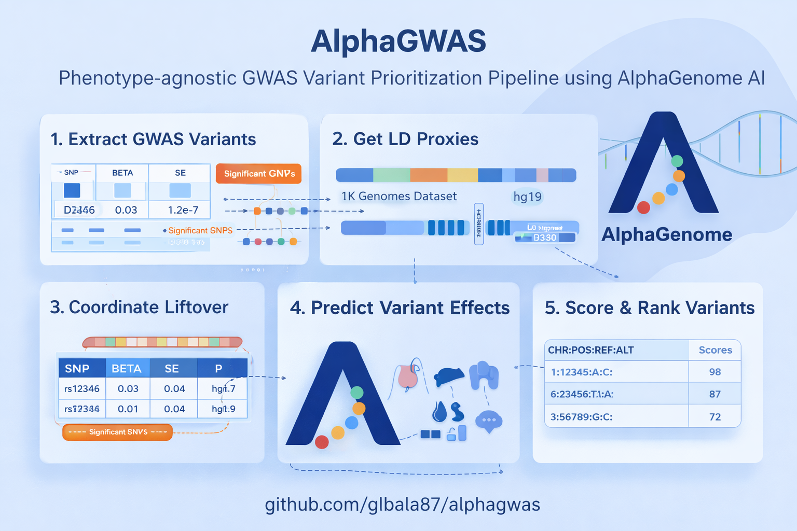

# AlphaGWAS

<p align="center">
  
</p>

<p align="center">
  <strong>Prioritizing Variants at GWAS Loci with AlphaGenome</strong>
</p>

<p align="center">
  <a href="https://github.com/glbala87/alphagwas/actions"></a>
  <a href="https://pypi.org/project/alphagwas/"></a>
  <a href="https://github.com/glbala87/alphagwas/blob/main/LICENSE"></a>
  <a href="https://www.python.org/downloads/"></a>
</p>

---

A comprehensive bioinformatics pipeline for identifying and ranking genetic variants at GWAS loci using Google DeepMind's [AlphaGenome](https://github.com/google-deepmind/alphagenome) AI model.

## Features

### Core Pipeline
- **Parallel Processing** - Multi-threaded AlphaGenome predictions
- **Progress Tracking** - Real-time progress bars with rich output
- **Checkpoint/Resume** - Continue interrupted runs seamlessly
- **Automatic Retry** - Exponential backoff for robust API calls

### Visualizations
- **Static Plots** - Manhattan plots, tissue heatmaps, effect distributions
- **Interactive Plots** - Zoomable Plotly visualizations with hover details
- **LocusZoom Plots** - Regional association plots with LD coloring
- **PDF Reports** - Publication-ready summary reports

### Advanced Analysis
- **Colocalization** - COLOC/eCAVIAR for cross-trait analysis
- **Mendelian Randomization** - IVW, MR-Egger, weighted median methods
- **Polygenic Risk Scores** - PRS calculation with validation
- **Multi-Phenotype Comparison** - Pleiotropic variant identification
- **Fine-Mapping Integration** - SuSiE/FINEMAP support
- **Pathway Enrichment** - GO, KEGG, Reactome analysis

### Integrations
- **REST API** - FastAPI-based programmatic access
- **Authentication** - JWT/API key authentication with RBAC
- **Job Queue** - Celery/Redis for scalable async processing
- **Database Backend** - SQLite/PostgreSQL for persistent storage
- **Streamlit Dashboard** - Interactive web application
- **Cloud Deployment** - Terraform templates for AWS

### Developer Experience
- **CLI with Autocomplete** - Rich Click CLI with shell completion
- **Docker Support** - Multi-stage builds and docker-compose
- **CI/CD Pipelines** - GitHub Actions for testing and deployment
- **Pre-commit Hooks** - Code quality automation
- **Comprehensive Tests** - 52+ pytest tests with fixtures

## Installation

### Quick Install

```bash
pip install alphagwas
```

### Full Install (All Features)

```bash
# Clone repository
git clone https://github.com/glbala87/alphagwas.git
cd alphagwas

# Install with all features
pip install -e ".[all]"

# Install AlphaGenome
git clone https://github.com/google-deepmind/alphagenome.git
pip install ./alphagenome
```

### Optional Dependencies

```bash
pip install alphagwas[viz]        # Visualization (matplotlib, plotly)
pip install alphagwas[api]        # REST API (fastapi, uvicorn)
pip install alphagwas[database]   # Database (sqlalchemy, psycopg2)
pip install alphagwas[streamlit]  # Web dashboard
pip install alphagwas[cli]        # Rich CLI with autocomplete
pip install alphagwas[all]        # Everything
```

## Quick Start

### 1. Basic Pipeline

```bash
# Run full pipeline
python run_pipeline.py \
  --input data/input/gwas_sumstats.tsv \
  --output data/output/ \
  --config config/config.yaml

# Run specific steps
python run_pipeline.py --step 1    # Extract variants
python run_pipeline.py --step 2    # Get LD proxies
python run_pipeline.py --step 3    # Liftover coordinates
python run_pipeline.py --step 4    # AlphaGenome predictions
python run_pipeline.py --step 5    # Score and rank
python run_pipeline.py --step 6    # Generate visualizations
```

### 2. Using the CLI

```bash
# Show help
alphagwas --help

# Run pipeline
alphagwas run --input gwas.tsv --output results/

# Extract significant variants
alphagwas extract --input gwas.tsv --pval 5e-8

# Generate visualizations
alphagwas visualize --input results/ranked_variants.tsv --output plots/

# Generate PDF report
alphagwas report --input results/ranked_variants.tsv --output report.pdf

# Enable shell autocompletion
alphagwas completion bash >> ~/.bashrc   # Bash
alphagwas completion zsh >> ~/.zshrc     # Zsh
alphagwas completion fish > ~/.config/fish/completions/alphagwas.fish  # Fish
```

### 3. Python API

```python
from scripts import extract_variants, score_variants, alphagenome_predict
import pandas as pd

# Load GWAS data
gwas_df = pd.read_csv("gwas_sumstats.tsv", sep="\t")

# Extract significant variants
config = {'gwas': {'pvalue_threshold': 5e-8}}
significant = extract_variants.extract_significant_variants(gwas_df, config)
lead_snps = extract_variants.identify_lead_snps(significant)

# Run predictions
predictor = alphagenome_predict.AlphaGenomePredictor(config={})
predictions = predictor.predict_batch(lead_snps)

# Score and rank
scorer = score_variants.VariantScorer({})
predictions_df = pd.DataFrame(predictions)
tissue_scores = scorer.calculate_tissue_scores(predictions_df)
consensus = scorer.calculate_consensus_scores(tissue_scores)
ranked = scorer.rank_variants(consensus)

# Save results
ranked.to_csv("ranked_variants.tsv", sep="\t", index=False)
```

### 4. REST API

```bash
# Start API server
uvicorn scripts.api:app --host 0.0.0.0 --port 8000

# Or via CLI
alphagwas api start --port 8000
```

```bash
# Submit analysis job
curl -X POST "http://localhost:8000/api/v1/jobs" \
  -F "file=@gwas_data.tsv" \
  -F "name=my_analysis"

# Check job status
curl "http://localhost:8000/api/v1/jobs/{job_id}"

# Get results
curl "http://localhost:8000/api/v1/jobs/{job_id}/results"
```

### 5. Streamlit Dashboard

```bash
streamlit run app.py
# Opens at http://localhost:8501
```

### 6. Docker

```bash
# Run with Docker
docker run -v $(pwd)/data:/app/data alphagwas:latest \
  python run_pipeline.py --input /app/data/gwas.tsv

# Using docker-compose
docker-compose up pipeline
```

## Advanced Features

### Mendelian Randomization

```python
from scripts.mendelian_randomization import MendelianRandomization

mr = MendelianRandomization(exposure_df, outcome_df, "LDL", "CAD")
results = mr.run_all_methods()

for r in results:
    print(f"{r.method}: beta={r.beta:.3f}, p={r.pvalue:.2e}")
```

### Polygenic Risk Scores

```python
from scripts.prs import PRSCalculator

calculator = PRSCalculator(gwas_df)
model = calculator.create_model(pval_threshold=5e-8)
scores = calculator.calculate_scores(genotypes, model)
```

### Colocalization

```python
from scripts.colocalization import run_colocalization

results = run_colocalization(
    gwas1_path="trait1.tsv",
    gwas2_path="trait2.tsv",
    method="coloc"
)
```

### Multi-Phenotype Comparison

```python
from scripts.multiphenotype import run_multiphenotype_analysis

results = run_multiphenotype_analysis(
    gwas_files=["ldl.tsv", "hdl.tsv", "cad.tsv"],
    phenotype_names=["LDL", "HDL", "CAD"],
    output_dir="multiphenotype_results/"
)
```

## Configuration

```yaml
# config/config.yaml
study:
  name: "my_gwas"
  phenotype: "my_trait"

gwas:
  input_file: "data/input/my_gwas.tsv"
  columns:
    chromosome: "CHR"
    position: "BP"
    rsid: "SNP"
    effect_allele: "A1"
    other_allele: "A2"
    pvalue: "P"
  pvalue_threshold: 5.0e-8

alphagenome:
  tissues:
    - "Heart_Left_Ventricle"
    - "Liver"
    - "Whole_Blood"
  modalities:
    - "expression"
    - "chromatin_accessibility"
  max_workers: 4
  checkpoint_every: 50
```

## Output Files

| File | Description |
|------|-------------|
| `ranked_variants.tsv` | Variants ranked by functional impact |
| `tissue_scores.tsv` | Tissue-specific scores |
| `predictions.parquet` | AlphaGenome predictions |
| `manhattan.png` | Manhattan plot |
| `tissue_heatmap.png` | Tissue effect heatmap |
| `report.pdf` | PDF summary report |

## Cloud Deployment

Deploy to AWS using Terraform:

```bash
cd deploy/terraform
cp terraform.tfvars.example terraform.tfvars
# Edit terraform.tfvars

terraform init
terraform apply
```

See [deploy/README.md](deploy/README.md) for full instructions.

## Testing

```bash
# Run all tests
pytest tests/ -v

# Run with coverage
pytest tests/ -v --cov=scripts --cov-report=html

# Run specific tests
pytest tests/test_score_variants.py -v
```

## Project Structure

```
alphagwas/
├── scripts/                 # Core modules
│   ├── extract_variants.py  # GWAS variant extraction
│   ├── alphagenome_predict.py  # AlphaGenome predictions
│   ├── score_variants.py    # Scoring and ranking
│   ├── visualize.py         # Static visualizations
│   ├── api.py               # REST API
│   ├── auth.py              # Authentication
│   ├── queue.py             # Job queue
│   ├── database.py          # Database backend
│   ├── colocalization.py    # Colocalization analysis
│   ├── mendelian_randomization.py  # MR analysis
│   ├── prs.py               # Polygenic risk scores
│   ├── multiphenotype.py    # Multi-phenotype comparison
│   └── cli.py               # Command-line interface
├── tests/                   # Test suite
├── docs/                    # MkDocs documentation
├── deploy/                  # Cloud deployment
│   └── terraform/           # AWS Terraform configs
├── notebooks/               # Jupyter tutorials
├── app.py                   # Streamlit dashboard
├── run_pipeline.py          # Main entry point
├── Dockerfile               # Docker image
├── docker-compose.yml       # Docker services
└── pyproject.toml           # Package configuration
```

## Supported Tissues

| Category | Tissues |
|----------|---------|
| Cardiovascular | Heart (Left Ventricle, Atrial Appendage), Arteries |
| Metabolic | Liver, Adipose, Pancreas |
| Brain | Cortex, Cerebellum, Hippocampus |
| Other | Whole Blood, Skeletal Muscle, Lung, Kidney |

## Documentation

- **User Guide**: [docs/guide/](docs/guide/)
- **API Reference**: [docs/api/](docs/api/)
- **Examples**: [notebooks/](notebooks/)

## Contributing

See [CONTRIBUTING.md](docs/contributing.md) for guidelines.

```bash
# Setup development environment
pip install -e ".[dev]"
pre-commit install

# Run tests
pytest tests/ -v

# Format code
black scripts/ tests/
isort scripts/ tests/
```

## Author

**BalaSubramani Gattu Linga** ([@glbala87](https://github.com/glbala87))

## License

MIT License - see [LICENSE](LICENSE) for details.

## Acknowledgments

- [AlphaGenome](https://github.com/google-deepmind/alphagenome) by Google DeepMind
- Inspired by [alphagenome-test](https://github.com/aa9gj/alphagenome-test)

## Citation

If you use AlphaGWAS in your research, please cite:

```bibtex
@software{alphagwas,
  author = {Gattu Linga, BalaSubramani},
  title = {AlphaGWAS: GWAS Variant Prioritization with AlphaGenome},
  url = {https://github.com/glbala87/alphagwas},
  year = {2024}
}
```
