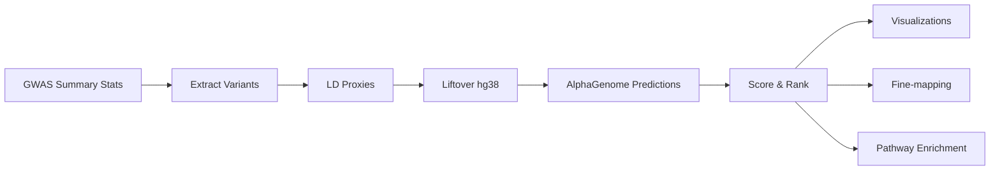

# AlphaGWAS

**Prioritizing Variants at GWAS Loci with AlphaGenome**

[](https://github.com/glbala87/alphagwas/actions/workflows/ci.yml)
[](https://github.com/glbala87/alphagwas/actions/workflows/docker.yml)
[](https://www.python.org/downloads/)
[](https://opensource.org/licenses/MIT)

---

## Overview

AlphaGWAS is a comprehensive bioinformatics pipeline for identifying and ranking genetic variants at GWAS loci using Google DeepMind's [AlphaGenome](https://github.com/google-deepmind/alphagenome) AI model.

## Key Features

- **🧬 AlphaGenome Integration** - Leverage deep learning predictions for variant functional effects
- **⚡ Parallel Processing** - Multi-threaded predictions for faster execution
- **📊 Interactive Visualizations** - Manhattan plots, tissue heatmaps, and dashboards
- **🔬 Statistical Fine-mapping** - SuSiE and FINEMAP integration
- **🛤️ Pathway Enrichment** - GO, KEGG, Reactome analysis
- **📝 Comprehensive Annotations** - ClinVar, gnomAD, GTEx integration
- **🐳 Docker Support** - Containerized deployment
- **🌐 Web Dashboard** - Streamlit interface for interactive analysis

## Pipeline Workflow



## Quick Start

```bash
# Install
pip install alphagwas

# Run pipeline
python run_pipeline.py --config config/config.yaml

# Launch dashboard
streamlit run app.py
```

## Example Output

The pipeline generates:

| Output | Description |
|--------|-------------|
| `ranked_variants.tsv` | All variants ranked by functional impact |
| `tissue_scores.tsv` | Tissue-specific effect scores |
| `dashboard.html` | Interactive HTML report |
| `enrichment_results.tsv` | Pathway enrichment results |

## Citation

If you use AlphaGWAS in your research, please cite:

```bibtex
@software{alphagwas,
  author = {Gattu Linga, BalaSubramani},
  title = {AlphaGWAS: GWAS Variant Prioritization using AlphaGenome},
  url = {https://github.com/glbala87/alphagwas},
  year = {2024}
}
```

## License

MIT License - see [LICENSE](https://github.com/glbala87/alphagwas/blob/main/LICENSE) for details.
